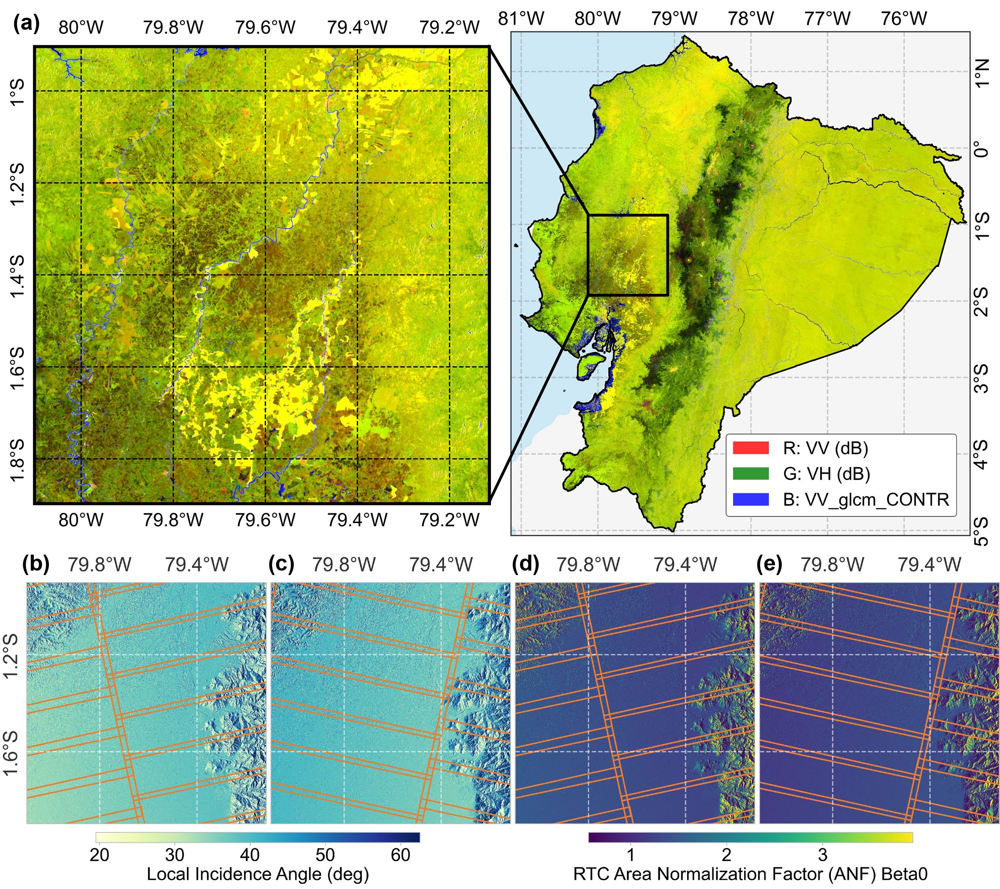
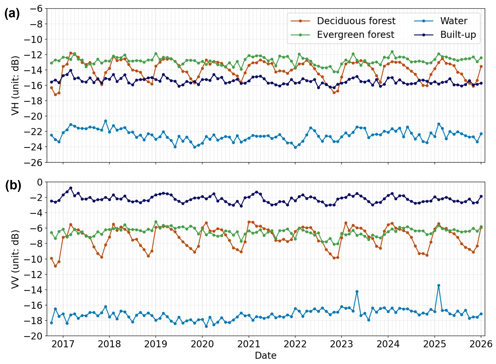

<p align="center">
  <picture>
    <source media="(prefers-color-scheme: dark)" srcset="assets/logo/logo-dark.png">
    
  </picture>
</p>

<!-- <h1 align="center">S1-GRiTS: Sentinel-1 Gridded RTC Time Series Data Cube</h1> -->

<p align="center">
  <em>A Sentinel-1 spatiotemporal data cube ready for direct agentic access.</em>
  <br>
  <em>Each pixel knows where it came from. Geometry is not erased.</em>
</p>
<p align="center"><strong>English</strong> | <a href="README.zh-CN.md">简体中文</a></p>
<p align="center">
  <a href="https://www.python.org/downloads/">
    
  </a>
  <a href="LICENSE">
    
  </a>
  <a href="https://github.com/ottoKae/S1-GRiTS">
    
  </a>
</p>

---

<p align="center">
  S1-GRiTS (Sentinel-1 Gridded RTC Time Series) is a Python package for building analysis-ready Sentinel-1 SAR time-series data cubes from ASF OPERA RTC-S1 products.
  It converts burst-level observations into MGRS-aligned, temporally consistent Zarr data cubes, with optional COG exports.
</p>


## For Reviewers — Paper ↔ Code

> This repository is the **open-source implementation of the manuscript** below. This section lets reviewers (1) confirm that every key technique described in the paper is actually implemented, and (2) reproduce the reported figures and tables.

**Manuscript:** *Sentinel-1 Gridded Time Series (S1-GRiTS): Geometry-traceable SAR Data Cubes for decadal vegetation monitoring in cloud-prone regions* — Rao et al., 2026 (under review).

**Software:** `s1grits` — [GitHub](https://github.com/ottoKae/S1-GRiTS) · [PyPI](https://pypi.org/project/s1grits/) (`pip install s1grits`).

**Validation testbed:** mainland Ecuador, MGRS tile **17MPU**, 2017–2025.

### Key technique → implementation map

Each row links a core methodological claim in the paper to the module/function and the CLI entry point that runs it.

| Paper technique (section) | Implemented in | Run via |
|---|---|---|
| **Burst-first deterministic acquisition grouping** by `(mgrs_tile_id, acq_group_id_within_mgrs_tile, pass_id)` + `track_token`, `pass_id` 6-day cycle (§3.1, Table 2) | `asf_tiles.py` (`extract_pass_id`, group/`track_token` build), `dist_enum.py` | `s1grits process_scenes` |
| **First-valid-pixel mosaicking** (source control, *not* radiometric fusion) (§3.1) | `asf_output_writing.py` → `_mosaic_align()` ("first burst covering each pixel wins") | scenes workflow and its static post-stage |
| **Orbit-direction separation + one Zarr per acquisition group** (§3.2) | `workflow_scenes.py`, `asf_output_writing.py` → `merge_acq_group_zarrs()` | `s1grits process_scenes` |
| **Cloud-native S3 streaming, zero-disk, in-memory virtual file → rasterio → float32** (§3.3) | `asf_io.py` (`rasterio.io.MemoryFile`), `rtc_s1_io.py` (streaming HTTP session) | `s1grits process_scenes` and its static post-stage |
| **Adaptive temporal batching + memory-bounded parallelism** (Eq. 1–2, §3.3) | `memory_manager.py` (`detect_system_memory` via psutil, `select_batch_strategy`/`chunk_time_by_strategy`: yearly/quarterly/monthly) | `parallel` / `memory` config blocks |
| **Temporal median compositing + TV-Bregman despeckle before tile-clip** (§3.2) | `asf_io.py` → `load_and_despeckle_rtc_strict` (`tv_bregman`), `asf_array_processing.despeckle_2d` | `s1grits process_scenes` (`processing.monthly`) |
| **Incremental, appendable Zarr cube + STAC 1.1.0 + Parquet catalogs** (§3.2) | `stac_builder.py` (`STAC_VERSION = "1.1.0"`, datacube ext v2.3.0), `catalog_sync.py`, `canonical_catalog_schema.py` | `s1grits catalog inspect` |
| **Static acquisition-geometry layers** (LIA, inc. angle, layover/shadow, looks, ANF β0/σ0) (§2.2, §4.1) | `workflow_static.py` (`local_inc_angle`, `inc_angle`, `ls_map`, `number_of_looks`, `rtc_anf_beta0`, `rtc_anf_sigma0`) | scenes YAML or `s1grits static ensure` |
| **Cross-orbit (ASC–DESC) backscatter offset quantification vs. LIA/ANF** (§3.4, §4.3, Table 3) | `manuscript_analysis_scripts/c05_t03_*`, `c05_f07_*` | run scripts (see below) |

### Dynamic/static co-location and pairing contract

Dynamic backscatter cubes and their acquisition-geometry layers belong to one
logical data cube. They therefore share one `output.base_dir` and one root
`catalog.parquet`. The products are siblings under each MGRS tile—not separate
archives and not nested inside one another:

```text
{base_dir}/
  catalog.parquet
  17MNV/
    smonthly_ASCENDING/
      zarr/s1grits_smonthly_17MNV_ASCENDING_TK18.zarr
    static_ASCENDING/
      zarr/s1grits_static_17MNV_ASCENDING_TK18_Nxx.zarr
```

Static data has exactly two production entry points: enable the static
post-stage in a `workflow_scenes` YAML, or run `s1grits static ensure` against
an already cataloged dynamic product. A standalone static YAML is deliberately
unsupported because it could silently select a different grid or geometry.

RTC-STATIC values are always **raw-aligned**. The six source variables are
stored without speckle filtering, spatial filtering, normalization, temporal
compositing, or derived features. Only the geometric mosaicking/reprojection
needed to place them on the authoritative dynamic pixel grid is allowed. This
policy does not change when the dynamic scenes use spatial filtering.

Pairing is geometry-strict. A dynamic `smonthly` store and a `static` store
may be combined only when they share the track-level key
`geometry_group_id = tile_id + flight_direction + track`. Burst count remains
provenance and is not part of this join key. A tile with more than one track
has one static product per matching acquisition geometry; static layers from
one track must never be attached to another track.

For production, `workflow_static` uses the matching `scenes` or `smonthly`
store as its grid authority and copies its CRS, affine transform, shape,
`x`/`y` coordinates, and canonical `grid_id`. The six OPERA RTC-STATIC
variables are stored once as 2-D `(y, x)` arrays; dynamic backscatter remains
3-D `(time, y, x)`. `CubeResolver` selects both products from the same catalog
by tile, direction, and track, and keeps static variables 2-D. Broadcasting is
deferred until a spatial patch or model batch requests it; static data is never
duplicated along the full time axis in the archive.

### Reproducing the paper's figures & tables

The `manuscript_analysis_scripts/` directory contains the exact scripts used to produce the published results:

| Script | Reproduces |
|---|---|
| `c01_f5a_gridded_composites_mosaics_ECU.py`, `c01_f5a_gridded_composites_17MPU.py` | **Fig. 5a** — Ecuador mosaic & tile 17MPU composite |
| `c04_f08_gridded_composites_mosaics_DEU.py` | **Fig. 8** — multi-region scalability (Bayern / Sahel / GBA / New Britain) |
| `c05_f07_evaluation_cross_orbit_offsets_LIA_ANF.py` | **Fig. 7** — cross-orbit offset spatial maps & LIA/ANF heatmaps |
| `c05_t03_evaluation_orbit_paris_offsets.py` | **Table 3** — ASC–DESC vs. within-orbit offset statistics |

**Published data products (Zenodo, no login/embargo):**
- Ecuador monthly DESC composites & mosaic (Jan 2026) — [10.5281/zenodo.20607389](https://doi.org/10.5281/zenodo.20607389)
- Tile 17MPU ASC gridded time series 2017–2025 — [10.5281/zenodo.20589543](https://doi.org/10.5281/zenodo.20589543)
- Tile 17MPU DESC gridded time series 2017–2025 — [10.5281/zenodo.20607919](https://doi.org/10.5281/zenodo.20607919)
- Multi-region scalability composites — [10.5281/zenodo.20604391](https://doi.org/10.5281/zenodo.20604391)
- Pixel-level orbit-pair statistics & static geometry — [10.5281/zenodo.20607604](https://doi.org/10.5281/zenodo.20607604)

### Reproduce the headline result in 3 commands

```bash
# 1. Generate the geometry-consistent gridded time series for the paper's study tile
s1grits process_scenes --config config/s1grits_scenes.yaml      # edit: manual_mgrs_tiles: ["17MPU"]

# 2. Generate the static acquisition-geometry layers (LIA, ANF β0) used in the offset analysis
s1grits static ensure --output-dir ./output --product-label smonthly_ASCENDING

# 3. Quantify cross-orbit ASC–DESC offsets (paper Table 3 / Fig. 7)
python manuscript_analysis_scripts/c01_f5a_gridded_composites_17MPU.py
```

---


## Features

S1-GRiTS is designed for researchers and practitioners who need **large-scale, long-term SAR time series analysis** without the complexity of raw data processing.

**Three Product Families:**

- **Monthly Composites** — Multi-year time series at monthly temporal resolution
- **Per-Scene Processing** — High-temporal-resolution outputs for event detection
- **Static Layers** — Time-invariant, acquisition-geometry layers aligned to the dynamic pixels

**Core Capabilities:**

1. **Zarr-First Data Cube Architecture** — Zarr stores are the primary time-series product, with lossless Zstandard level-7 compression for new stores; COG/preview are optional derivative exports
2. **Cloud-Native S3 Streaming** — Zero-disk download; data streamed directly from ASF S3
3. **MGRS Grid Alignment** — Products aligned to 100km MGRS tiles in native UTM projections
4. **Orbit-Direction Separation** — ASCENDING and DESCENDING processed independently for geometric consistency
5. **Acquisition Group Strategy** — Bursts grouped by (orbit, track, frame) for temporal coherence
6. **Standardized Gamma0 Radiometry** — Built on OPERA RTC-S1 with radiometric terrain correction
7. **Dual Speckle Suppression** — Temporal median compositing + optional spatial TV-Bregman filtering
8. **Incremental Time-Series Updates** — Zarr supports append-only updates without reprocessing
9. **STAC 1.1.0 Metadata** — Full STAC compliance with Parquet catalogs for fast queries
10. **Rich Analysis API** — 8 analysis submodules for data loading, time series extraction, visualization, validation

**Typical Use Cases:**

- Long-term deformation monitoring
- Agricultural crop classification
- Forest change detection
- Flood disaster assessment
- Land use / land cover mapping


**Figure 1.**  Burst-first MGRS-grid mosaic over Wuhan, China.


**Figure 2.** Burst-first MGRS-grid mosaic over mainland Ecuador and its 17MPU tile, demonstrating spatial consistency and seamless stitching across tile edges after despeckling (paper Fig. 5a).


**Figure 3.** Near-decadal (2017–2025) Sentinel-1 backscatter time series for representative objects.

---


## Quick Start

```bash
# 1. Install (Python 3.12; geospatial wheels ship for linux/macos/windows)
pip install s1grits

# 2. (Optional) Earthdata auth for ASF downloads — ~/.netrc with your
#    urs.earthdata.nasa.gov credentials. See docs/installation.md.

# 3. Copy a config template and set your ROI + time range
cp config/s1grits_scenes.yaml my_run.yaml

# 4. Validate the environment and config, then run
s1grits doctor --config my_run.yaml
s1grits process_scenes --config my_run.yaml

# 5. Browse results in the web interface
s1grits serve --root /path/to/output
```

Full installation options (conda, from-source, extras), authentication setup
and first-run guidance: **[docs/installation.md](docs/installation.md)**.

## Static layers

Static layers are time-invariant companions to a scenes or monthly cube. S1-GRiTS stores the six OPERA RTC-STATIC variables—local incidence angle, incidence angle, layover/shadow mask, number of looks, and the β0/σ0 area-normalization factors—once per `tile + direction + track`. They share the dynamic product's exact pixel grid, tile directory, root catalog, and `geometry_group_id`. Static values are not despeckled, spatially filtered, normalized, temporally composited, or stored repeatedly along the time axis.

For a new run, enable the post-stage in the same scenes YAML:

```yaml
static_layers:
  run_after_scenes: true
  grid_reference: required
  reference_product_type: smonthly   # use scenes for a per-scene cube
  on_failure: fail
```

Then run the normal command:

```bash
s1grits process_scenes --config my_run.yaml
```

To add missing static layers to an existing cataloged cube, point `static ensure` to the same root directory and provide an exact dynamic `product_label` from `catalog.parquet`. Run `catalog resync` first only when the catalog is missing or stale. The ensure command is idempotent: complete matching stores are skipped, and only missing geometry groups are created.

```bash
# Only needed when catalog.parquet is missing or stale:
s1grits catalog resync --output-dir /path/to/output
s1grits static ensure --output-dir /path/to/output --product-label smonthly_ASCENDING
# Optional tile scope (repeat --tile for several tiles): --tile 17MPU
```

Standalone static YAML downloads are intentionally unsupported because static geometry must always be derived from an authoritative dynamic product. See **[Static/scenes alignment](docs/static_scenes_alignment.md)** for the detailed contract.

## Documentation

| Page | Contents |
|---|---|
| [Installation](docs/installation.md) | Prerequisites, pip/conda/source installs, Earthdata auth, doctor |
| [Architecture](docs/architecture.md) | Zarr-first philosophy, acquisition groups, workflow comparison |
| [Workflows](docs/workflows.md) | Monthly composites, per-scene processing, static layers |
| [Output Structure](docs/outputs.md) | Zarr/COG/preview specs, bands, STAC metadata, parquet catalogs |
| [Configuration Reference](docs/configuration.md) | Every YAML key the workflows read, with defaults |
| [CLI Reference](docs/cli.md) | All commands: process, catalog, tile, mosaic, doctor, cache, serve |
| [Python API](docs/python_api.md) | `s1grits.analysis` — loading, time series, plotting, validation |
| [Examples](docs/examples.md) | End-to-end usage examples and the tutorial notebooks |
| [Web Interface](docs/webapp.md) | The v2.3 web UI (`s1grits serve`) |
| [Bounded-Memory Architecture](docs/scenes_blockwise_architecture.md) | The blockwise scenes pipeline design |
| [FAQ](docs/faq.md) | Common questions and troubleshooting |
| [Changelog](CHANGELOG.md) | Release history |


## License & Citation

### License

Copyright 2026 KaeRao

S1-GRiTS is **dual-licensed**:

* **Noncommercial use** (academic research, education, personal projects,
  government/nonprofit research, evaluation): licensed under the
  **[PolyForm Noncommercial License 1.0.0](LICENSE)**. You may use, modify,
  and redistribute the software freely for any noncommercial purpose, with
  attribution preserved.
* **Commercial use** (use in or for a for-profit product, service, or
  operation): requires a **separate commercial license** — see
  [LICENSE-COMMERCIAL.md](LICENSE-COMMERCIAL.md) and contact the author.

The license governs *distribution and use terms only*; it places no
technical restrictions on local execution — all workflows run identically
regardless of license class. Versions released before v2.3.0 were published
under Apache-2.0 and remain available under those terms for their
recipients.

### Citation

If you use S1-GRiTS in your research, please cite both the paper and the software.

**Paper (under review):**

```text
Rao, K., Lei, L., Dong, S., Alvarez, C. I., Zou, L., Hu, Z., & Wu, Z. (2026).
Sentinel-1 Gridded Time Series (S1-GRiTS): Geometry-traceable SAR Data Cubes
for decadal vegetation monitoring in cloud-prone regions. (under review).
```

**Software:**

```text
KaeRao. (2026). S1-GRiTS: Sentinel-1 Gridded RTC Time Series Data Cube (Version 3.0.0).
GitHub: https://github.com/ottoKae/S1-GRiTS
```

**BibTeX:**
```bibtex
@article{rao2026s1grits,
  author  = {Rao, Keyi and Lei, Lei and Dong, Shixin and Alvarez, Cesar Ivan
             and Zou, Linxin and Hu, Zhongwen and Wu, Zhaocong},
  title   = {Sentinel-1 Gridded Time Series (S1-GRiTS): Geometry-traceable SAR
             Data Cubes for decadal vegetation monitoring in cloud-prone regions},
  year    = {2026},
  note    = {under review}
}

@software{s1grits2026,
  author       = {KaeRao},
  title        = {S1-GRiTS: Sentinel-1 Gridded RTC Time Series Data Cube},
  year         = {2026},
  version      = {3.0.0},
  url          = {https://github.com/ottoKae/S1-GRiTS},
  note         = {A companion paper is under review}
}
```

---

## Acknowledgements

**[@ottoKae](https://github.com/ottoKae)** designed and planned the entire S1-GRiTS project, conducted all real-world testing and validation, ensured end-user usability, and performed quality assurance of all deliverables.

The burst-to-MGRS-tile enumeration and spatial speckle filtering approaches draw heavily from the [dist-s1-enumerator](https://github.com/opera-adt/dist-s1-enumerator) project by **OPERA/JPL**. We gratefully acknowledge their foundational work.

**OPERA RTC-S1 Products:** S1-GRiTS is built on NASA's OPERA (Observational Products for End-Users from Remote Sensing Analysis) RTC-S1 (Radiometric Terrain Corrected Sentinel-1) products. We acknowledge the OPERA team at JPL for providing analysis-ready SAR data.

Code optimization and production-ready implementation were carried out with assistance from **[@claude](https://claude.ai)** (Anthropic).

---

## Contributing

S1-GRiTS is currently under active development. Contributions, bug reports, and feature requests are welcome via GitHub Issues.

### Development Setup

```bash
# Clone repository
git clone https://github.com/ottoKae/S1-GRiTS.git
cd S1-GRiTS

# Create development environment
conda env create -f environment.yml --solver=libmamba
conda activate py312_s1grits

# Install in editable mode
pip install -e .

```
**Questions? Issues? Feature Requests?**

Open an issue on GitHub: https://github.com/ottoKae/S1-GRiTS/issues

---

*README last updated: 2026-08-11 | Version 3.0.0*
